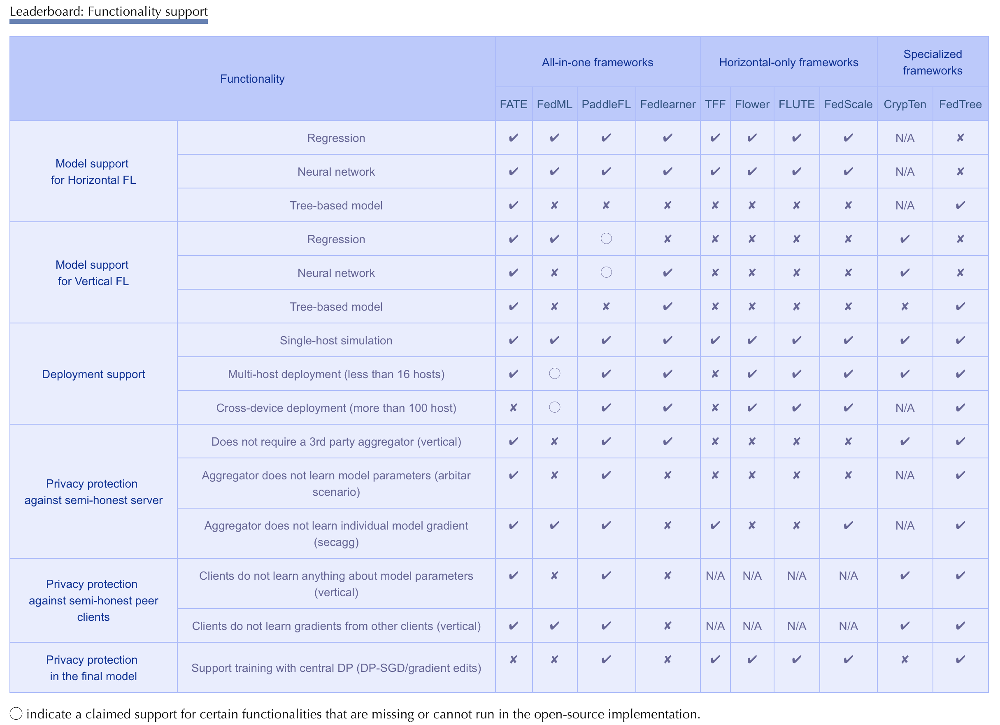

# Awesome Federated Computation Systems Papers

A curated list of **FL system**-related academic papers, articles, tutorials, slides and projects. 
Star this repository, and then you can keep abreast of the latest developments of this booming research field. 

Papers with 🎓 have been peer-reviewed and presented in academic conferences.

## FL system from big tech companies
### Paper

>Cross-device

- **Apple**:  Federated Evaluation and Tuning for On-Device Personalization: System Design & Applications | [`PDF`](https://arxiv.org/pdf/2102.08503.pdf), [`PDF`](https://docs-assets.developer.apple.com/ml-research/papers/learning-with-privacy-at-scale.pdf)
- **Google**: Towards Federated Learning at Scale: System Design | [`PDF`](https://arxiv.org/abs/1902.01046), [`Github`](https://www.tensorflow.org/federated)🎓
- **Meta**:  | Papaya: Practical, Private, and Scalable Federated Learning [`PDF`](https://arxiv.org/abs/2111.04877) 🎓
- **Microsoft**:  FLUTE: A Scalable, Extensible Framework for High-Performance Federated Learning Simulations | [`PDF`](https://arxiv.org/abs/2203.13789), [`Github`](https://github.com/microsoft/msrflute)
- **Alibaba-1**: | FederatedScope: A Flexible Federated Learning Platform for Heterogeneity [`PDF`](https://arxiv.org/pdf/2204.05011.pdf)

  > Federated Analytics
  - **LinkedIn**: | LinkedIn's Audience Engagements API: A Privacy Preserving Data Analytics System at Scale
 [`PDF`](https://arxiv.org/abs/2002.05839)
  - **Alibaba-2**: |  Walle: An End-to-End, General-Purpose, and Large-Scale Production System for Device-Cloud Collaborative Machine Learning [`PDF`](https://www.usenix.org/system/files/osdi22-lv.pdf), [`Github`](https://github.com/alibaba/MNN) 🎓

>Cross-silo

- **IBM**:  | IBM Federated Learning: An Enterprise Framework White Paper | [`PDF`](https://arxiv.org/pdf/2007.10987.pdf)
- **Nvidia**:  | Federated Learning for Healthcare Using NVIDIA *Clara* | [`PDF`](https://developer.download.nvidia.com/CLARA/Federated-Learning-Training-for-Healthcare-Using-NVIDIA-Clara.pdf)
- **WeBank**:  Federated Learning White Paper V1.0 | [`PDF`](​​https://aisp-1251170195.cos.ap-hongkong.myqcloud.com/fedweb/1552917186945.pdf),  [`Github`](https://github.com/FederatedAI/FATE)

### Framework
- Cisco: Flame | [`Github`](https://github.com/cisco-open/flame)
- OpenMined: PySyft | [`Github`](https://github.com/OpenMined/PySyft)
- Baidu: Paddle | [`Github`](https://github.com/PaddlePaddle/PaddleFL)
- ByteDance: Fedlearner | [`Github`](https://github.com/bytedance/fedlearner)
- Meta: FLSim [`Github`](https://github.com/facebookresearch/FLSim)

### Vertical FL
- OpenMined: PyVertical [`Github`](https://github.com/OpenMined/PyVertical), [`PDF`](https://arxiv.org/pdf/2104.00489.pdf)

## Open-source FL Framework
- [**FedScale**](https://github.com/SymbioticLab/FedScale): Benchmarking Model and System Performance of Federated Learning | [ICML 22](https://arxiv.org/abs/2105.11367) 🎓
- [EasyFL](https://github.com/EasyFL-AI/EasyFL): A Low-code Federated Learning Platform For Dummies
- [Flower](https://flower.dev/): A Friendly Federated Learning Research Framework
- [Sherpa](https://developers.sherpa.ai/privacy-technology/): Federated Learning and Differential Privacy Framework: Protect user privacy without renouncing the power of Artificial Intelligence
- [FedML](https://fedml.ai/): A Research Library and Benchmark for Federated Machine Learning 🎓
- [LEAF](https://github.com/TalwalkarLab/leaf): A Benchmark for Federated Settings 🎓
- [FedEval](https://github.com/Di-Chai/FedEval): A Benchmark System with a Comprehensive Evaluation Model for Federated Learning
- [OpenFed](https://openfed.readthedocs.io/README.html): A Comprehensive and Versatile Open-Source Federated Learning Framework
- [FEDn](https://github.com/scaleoutsystems/fedn): A scalable, resilient and model agnostic hierarchical federated learning framework. - [Paper](https://arxiv.org/abs/2103.00148)

[Figure 1: Framework Functionality Support](https://unifedbenchmark.github.io/leaderboard/index.html)

## Survey 
- [**UNIFED: A Benchmark for Federated Learning Frameworks**](https://unifedbenchmark.github.io/)
- [Towards Efficient Synchronous Federated Training: A Survey on System Optimization Strategies](https://arxiv.org/abs/2109.03999)
- [A Survey on Federated Learning Systems: Vision, Hype and Reality for Data Privacy and Protection](https://arxiv.org/pdf/1907.09693.pdf)
- [A Field Guide to Federated Optimization](https://arxiv.org/abs/2107.06917)
- [Characterizing Impacts of Heterogeneity in Federated Learning upon Large-Scale Smartphone Data](https://arxiv.org/pdf/2006.06983.pdf)
- [Advances and Open Problems in Federated Learning](https://arxiv.org/pdf/1912.04977.pdf)

## Federated Computation Systems 
- [λ-FL : Serverless Aggregation For Federated Learning](https://federated-learning.org/fl-aaai-2022/Papers/FL-AAAI-22_paper_44.pdf) | AAAI 22 🎓
- [Walle: An End-to-End, General-Purpose, and Large-Scale Production System for Device-Cloud Collaborative Machine Learning](https://www.usenix.org/system/files/osdi22-lv.pdf) | OSDI 22 🎓
- [Device-centric Federated Analytics At Ease](https://arxiv.org/pdf/2206.11491.pdf)

## Algorithm for FL Systems
- [Oort: Efficient Federated Learning via Guided Participant Selection](https://www.usenix.org/conference/osdi21/presentation/lai) | OSDI 21 🎓
- [Mistify: Automating DNN Model Porting for On-Device Inference at the Edge](https://www.usenix.org/conference/nsdi21/presentation/guo) | NSDI 21 🎓
- [Resource-Efficient Federated Learning](https://arxiv.org/abs/2111.01108)
- [Federated Learning with Buffered Asynchronous Aggregation](https://arxiv.org/abs/2106.06639?fbclid=IwAR2MqphvE6-_caw-MuXcjgHnFSXhJFdtbmqSEW92m-v_xeZCXXMJuqYx6Hs) | AISTATS 22 🎓
- [PyramidFL: A Fine-grained Client Selection Framework for efficient Federated Learning](https://cse.msu.edu/~caozc/papers/mobicom22-li.pdf) | MobiCom 22 🎓

## General insight for FL
- [On Large-Cohort Training for Federated Learning](https://openreview.net/forum?id=Kb26p7chwhf) | NeurIPS 2021 🎓
- [What Do We Mean by Generalization in Federated Learning?](https://openreview.net/forum?id=VimqQq-i_Q) | ICLR 2022 🎓

## Other FL paper list
- https://github.com/innovation-cat/Awesome-Federated-Machine-Learning
- https://github.com/chaoyanghe/Awesome-Federated-Learning
- https://github.com/weimingwill/awesome-federated-learning#resource-allocation
- https://github.com/youngfish42/Awesome-Federated-Learning-on-Graph-and-Tabular-Data#federated-learning-framework

